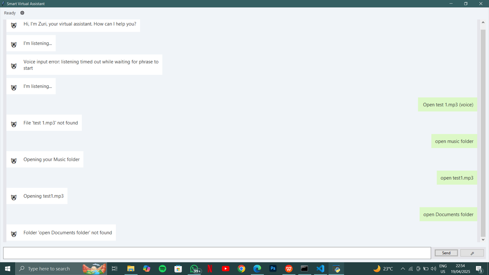

# VirtualAssistantZuri2.0
# Zuri - Smart Virtual Assistant

 *Add actual screenshot later*

A Python-based desktop virtual assistant for file management with voice and text commands, powered by AI speech recognition and natural language processing.

## Key Features

- **Multi-Modal Input**
  - Voice commands with real-time transcription
  - Text-based command interface
  - Hybrid voice/text command history

- **File Operations**
  - Open files/folders
  - Play media files
  - Search/copy/move/delete files
  - Recycle bin integration
  - System folder shortcuts

- **Smart Features**
  - Intent classification (ML model)
  - Filename pattern matching
  - Priority search paths
  - Error recovery & retry
  - Cross-platform support

- **User Interface**
  - Modern chat-style GUI
  - Real-time status indicators
  - Command history tracking
  - Interactive feedback system

## Installation

### Requirements
- Python 3.9+
- Windows/macOS/Linux
- Working microphone

### Setup
1. Clone repository:
   ```bash
   git clone https://github.com/yourusername/zuri-assistant.git
   cd zuri-assistant (create one if not exist)
# Windows
python -m venv venv
.\venv\Scripts\activate

# macOS/Linux
python3 -m venv venv
source venv/bin/activate

pip install -r requirements.txt
whisper download base

then run app using "python virtual_asistant.py"

# Testing the AI textually use:
1. Open folder Documents
2. i'm bored play a movie
3. play music
4. open folder Desktop
5. open music folder
6. open <filename.extension> (write the file name and it's extention)
7. delete <filename.extension> (write the file name and it's extention)(send to recycle bin)
8. delete permanently <filename.extension> (write the file name and it's extention)(permanent delete)
   
#Testing AI vocally
1. "Open folder Downloads"
2. "Play my rock playlist dot mp3"
3. "Find the final report underscore draft dot docx"
4. "Delete  <filename> dot <extension>"


10. Delete temporary_files.zip permanently
ual_assistant.py"
